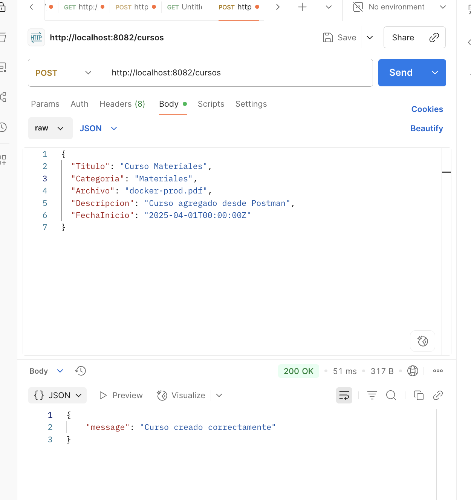
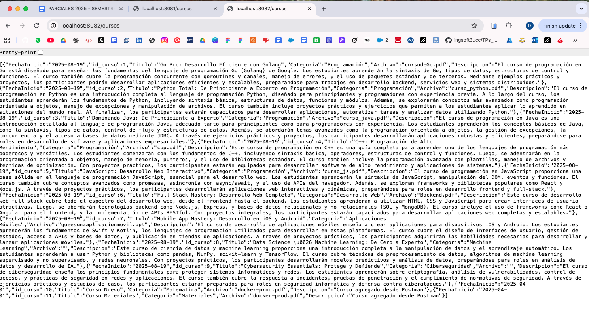
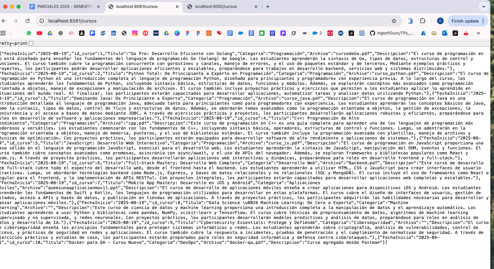

# Decisiones Técnicas - WebLearn Containerization

## 1. Elección de la Aplicación

**Aplicación elegida:** WebLearn - Plataforma de cursos online

**Justificación:**
- Aplicación full-stack completa (Go backend + React frontend + MySQL)
- Arquitectura real de producción con múltiples servicios
- Permite demostrar containerización de diferentes tecnologías
- Ya tenía funcionalidad completa implementada del TP anterior

## 2. Construcción de Imágenes Personalizadas

### Backend (Go)
**Imagen base:** `golang:1.21-alpine` (build) + `alpine:latest` (runtime)

**Justificación:**
- **Multi-stage build** para optimizar tamaño final
- **Alpine Linux** por ser liviana y segura (5MB vs 100MB+ de Ubuntu)
- **Compilación estática** para mejor rendimiento
- **Usuario no-root** para seguridad
- **Health checks** para monitoreo automático

**Instrucciones clave:**
\`\`\`dockerfile
# Build stage optimizado
FROM golang:1.21-alpine AS builder
RUN go mod download
RUN CGO_ENABLED=0 GOOS=linux go build -a -installsuffix cgo -o main .

# Runtime stage mínimo
FROM alpine:latest
RUN adduser -D -s /bin/sh appuser
USER appuser
\`\`\`

### Frontend (React)
**Imagen base:** `node:18-alpine` (build) + `nginx:1.25-alpine` (runtime)

**Justificación:**
- **Multi-stage build** para separar build de runtime
- **Node.js 18** para mejor rendimiento y soporte ES modules
- **Nginx Alpine** como servidor web optimizado
- **Configuración personalizada** con headers de seguridad
- **Compresión gzip** para mejor rendimiento

## 3. Estrategia de Versionado

**Tags utilizados:**
- `v1.0` - Versión específica para releases
- `latest` - Última versión estable

**Justificación:**
- **Versionado semántico** para control de releases
- **Tags específicos** para reproducibilidad
- **Latest tag** para desarrollo y testing

**Publicación en Docker Hub:**
- **Repositorios:** `delfisalinasmich/weblearn-backend` y `delfisalinasmich/weblearn-frontend`
- **Proceso de release:**
  \`\`\`bash
  # Tag con versión específica
  docker tag weblearn-backend delfisalinasmich/weblearn-backend:v1.0
  docker tag weblearn-frontend delfisalinasmich/weblearn-frontend:v1.0
  
  # Tag latest para desarrollo
  docker tag weblearn-backend delfisalinasmich/weblearn-backend:latest
  docker tag weblearn-frontend delfisalinasmich/weblearn-frontend:latest
  
  # Push a Docker Hub
  docker push delfisalinasmich/weblearn-backend:v1.0
  docker push delfisalinasmich/weblearn-frontend:v1.0
  \`\`\`

**Estrategia futura:**
- **v1.x** para patches y bug fixes
- **v2.x** para cambios mayores con breaking changes
- **Tags de entorno** como `qa`, `staging`, `prod` para diferentes ambientes

## 4. Base de Datos

**Base de datos elegida:** MySQL 8.0

**Justificación:**
- **Compatibilidad** con la aplicación existente
- **Soporte ARM64** para desarrollo en Mac Apple Silicon
- **Volúmenes persistentes** para durabilidad de datos
- **Configuración optimizada** para contenedores

**Configuración:**
\`\`\`yaml
db:
  image: mysql:8.0
  volumes:
    - mysql_data:/var/lib/mysql
  environment:
    MYSQL_ROOT_PASSWORD: ${DB_PASSWORD}
    MYSQL_DATABASE: weblearn
\`\`\`

## 5. Optimizaciones Implementadas

### Seguridad
- Usuarios no-root en todos los contenedores
- Headers de seguridad en nginx
- Variables de entorno para credenciales
- Imágenes base actualizadas

### Rendimiento
- Multi-stage builds para imágenes más pequeñas
- Compilación estática en Go
- Compresión gzip en nginx
- Cache optimizado para assets estáticos

### Monitoreo
- Health checks en todos los servicios
- Logs estructurados
- Configuración para diferentes entornos

## 6. Arquitectura Final

\`\`\`
┌─────────────────┐    ┌─────────────────┐    ┌─────────────────┐
│   Frontend      │    │    Backend      │    │    Database     │
│   (nginx)       │◄──►│     (Go)        │◄──►│    (MySQL)      │
│   Port: 80      │    │   Port: 8080    │    │   Port: 3306    │
└─────────────────┘    └─────────────────┘    └─────────────────┘
\`\`\`

**Red:** `app-network` (bridge) para comunicación entre servicios
**Volúmenes:** `mysql_data` para persistencia de base de datos

## 7. Configuración de Entornos QA y PROD

### Estrategia de Variables de Entorno

**Enfoque elegido:** Archivos `.env` separados por entorno

**Justificación:**
- **Separación clara** entre configuraciones de QA y PROD
- **Misma imagen** con diferentes comportamientos según variables
- **Seguridad** mediante contraseñas diferentes por entorno
- **Flexibilidad** para agregar nuevos entornos fácilmente

### Variables de Entorno Definidas

**Base de Datos:**
- `DB_HOST`, `DB_PORT`, `DB_USER`, `DB_PASSWORD`, `DB_NAME`
- Cada entorno tiene su propia base de datos independiente

**Aplicación:**
- `GIN_MODE`: `debug` (QA) vs `release` (PROD)
- `LOG_LEVEL`: `debug` (QA) vs `error` (PROD)
- `APP_ENV`: Identificación del entorno actual

**Frontend:**
- `REACT_APP_API_URL`: URLs diferentes para cada backend
- `REACT_APP_ENV`: Configuración específica del frontend

### Configuración por Entorno

**QA (Desarrollo/Testing):**
\`\`\`yaml
# Puertos: Frontend 8001, Backend 8081, DB 3308
# Modo debug activado para logs detallados
# Base de datos: weblearn_qa
# Contraseña: qa_password_2024
\`\`\`

**PROD (Producción):**
\`\`\`yaml
# Puertos: Frontend 8002, Backend 8082, DB 3309
# Modo release para mejor rendimiento
# Base de datos: weblearn_prod
# Contraseña: prod_secure_password_2024
# Límites de recursos configurados
\`\`\`

### Ejecución Simultánea

**Comandos de gestión:**
\`\`\`bash
# Iniciar ambos entornos
./start-environments.sh

# Detener ambos entornos
./stop-environments.sh
\`\`\`

**URLs de acceso:**
- **QA:** Frontend `http://localhost:8001`, Backend `http://localhost:8081`
- **PROD:** Frontend `http://localhost:8002`, Backend `http://localhost:8082`

### Beneficios de esta Arquitectura

1. **Aislamiento completo** entre entornos
2. **Misma imagen** garantiza consistencia
3. **Configuración flexible** mediante variables
4. **Fácil escalabilidad** para nuevos entornos
5. **Testing seguro** sin afectar producción

### Arquitectura Multi-Entorno

\`\`\`
┌─────────────────────────────────────────────────────────────┐
│                    MISMO HOST                                │
├─────────────────────────────────────────────────────────────┤
│  QA Environment          │         PROD Environment         │
│  ┌─────────┐ ┌─────────┐ │ ┌─────────┐ ┌─────────┐         │
│  │Frontend │ │Backend  │ │ │Frontend │ │Backend  │         │
│  │:8001    │ │:8081    │ │ │:8002    │ │:8082    │         │
│  └─────────┘ └─────────┘ │ └─────────┘ └─────────┘         │
│       │           │      │      │           │              │
│  ┌─────────────────┐     │ ┌─────────────────┐             │
│  │   MySQL QA      │     │ │   MySQL PROD    │             │
│  │   :3308         │     │ │   :3309         │             │
│  └─────────────────┘     │ └─────────────────┘             │
└─────────────────────────────────────────────────────────────┘

## 8. Entorno Reproducible con Docker Compose

### Estrategia de Reproducibilidad

**Archivo unificado:** `docker-compose.yml` que levanta QA y PROD simultáneamente

**Garantías de reproducibilidad:**

1. **Versiones fijas de imágenes**
   - Backend: `delfisalinasmich/weblearn-backend:v1.0`
   - Frontend: `delfisalinasmich/weblearn-frontend:v1.0`
   - Base de datos: `mysql:8.0` (versión específica)

2. **Variables de entorno centralizadas**
   - Archivos `.env.qa` y `.env.prod` con configuraciones específicas
   - Variables de entorno explícitas en docker-compose.yml
   - Configuración consistente entre entornos

3. **Volúmenes nombrados persistentes**
   - `mysql_data_qa` y `mysql_data_prod` para persistencia de datos
   - Inicialización automática con `init-db.sql`
   - Separación completa de datos entre entornos

4. **Health checks automáticos**
   - Verificación de estado de todos los servicios
   - Reintentos automáticos en caso de falla
   - Monitoreo continuo de disponibilidad

5. **Límites de recursos definidos**
   - Memoria limitada para PROD (optimización)
   - Recursos reservados para garantizar disponibilidad
   - Prevención de consumo excesivo de recursos

6. **Redes aisladas**
   - `weblearn-qa-network` y `weblearn-prod-network`
   - Aislamiento completo entre entornos
   - Comunicación interna segura

### Configuración de Servicios

**QA Environment:**
\`\`\`yaml
# Puertos: 8001 (frontend), 8081 (backend), 3308 (db)
# Modo debug para desarrollo y testing
# Health checks cada 30 segundos
# Sin límites de recursos para flexibilidad
\`\`\`

**PROD Environment:**
\`\`\`yaml
# Puertos: 8002 (frontend), 8082 (backend), 3309 (db)
# Modo release para rendimiento óptimo
# Límites de memoria configurados
# Health checks más estrictos
\`\`\`

### Comandos de Gestión

**Iniciar entorno completo:**
\`\`\`bash
docker-compose up -d
\`\`\`

**Ver estado de servicios:**
\`\`\`bash
docker-compose ps
\`\`\`

**Ver logs específicos:**
\`\`\`bash
docker-compose logs backend-qa
docker-compose logs backend-prod
\`\`\`

**Detener entorno:**
\`\`\`bash
docker-compose down
\`\`\`

### Asegurar Ejecución Idéntica

**Prerrequisitos documentados:**
- Docker Engine 20.10+
- Docker Compose 2.0+
- Puertos específicos disponibles
- 4GB RAM mínimo

**Archivos de configuración:**
- `.env.qa` y `.env.prod` con variables específicas
- `init-db.sql` para inicialización de base de datos
- `docker-compose.yml` con configuración completa

**Verificación automática:**
- Health checks en todos los servicios
- Dependencias explícitas entre servicios
- Reinicio automático en caso de falla

**Script de configuración:**
\`\`\`bash
# setup-environment.sh verifica prerrequisitos
# Crea archivos de configuración faltantes
# Valida que el entorno esté listo
\`\`\`

### Beneficios del Entorno Unificado

1. **Un solo comando** levanta QA y PROD
2. **Configuración centralizada** en un archivo
3. **Aislamiento garantizado** entre entornos
4. **Monitoreo automático** de todos los servicios
5. **Reproducibilidad total** en cualquier máquina
6. **Escalabilidad** para agregar nuevos entornos

### Arquitectura Final

\`\`\`
┌─────────────────────────────────────────────────────────────┐
│                 DOCKER COMPOSE UNIFICADO                    │
├─────────────────────────────────────────────────────────────┤
│  QA Network              │         PROD Network             │
│  ┌─────────┐ ┌─────────┐ │ ┌─────────┐ ┌─────────┐         │
│  │Frontend │ │Backend  │ │ │Frontend │ │Backend  │         │
│  │:8001    │ │:8081    │ │ │:8002    │ │:8082    │         │
│  │HealthCk │ │HealthCk │ │ │HealthCk │ │HealthCk │         │
│  └─────────┘ └─────────┘ │ └─────────┘ └─────────┘         │
│       │           │      │      │           │              │
│  ┌─────────────────┐     │ ┌─────────────────┐             │
│  │   MySQL QA      │     │ │   MySQL PROD    │             │
│  │   :3308         │     │ │   :3309         │             │
│  │   HealthCheck   │     │ │   HealthCheck   │             │
│  │   Volume: qa    │     │ │   Volume: prod  │             │
│  └─────────────────┘     │ └─────────────────┘             │
└─────────────────────────────────────────────────────────────┘
  ## 9. Convención de Versionado de Imágenes

### Estrategia de Versionado Elegida: Semantic Versioning (SemVer)

**Formato:** `MAJOR.MINOR.PATCH` (ej: v1.0.0, v1.1.0, v2.0.0)

### Implementación Actual

**Versión estable:** `v1.0`
- Backend: `delfisalinasmich/weblearn-backend:v1.0`
- Frontend: `delfisalinasmich/weblearn-frontend:v1.0`

**Tags adicionales:**
- `latest`: Apunta siempre a la versión más reciente estable
- `v1.0`: Versión específica para reproducibilidad

### Justificación de la Convención

**1. Semantic Versioning (SemVer)**
- **MAJOR** (v2.0): Cambios incompatibles en la API
- **MINOR** (v1.1): Nueva funcionalidad compatible hacia atrás
- **PATCH** (v1.0.1): Correcciones de bugs compatibles

**2. Beneficios de esta estrategia:**
- **Reproducibilidad**: Versiones específicas garantizan builds idénticos
- **Rollback seguro**: Fácil volver a versiones anteriores
- **Gestión de dependencias**: Control preciso de versiones
- **CI/CD friendly**: Automatización de releases basada en tags

**3. Estrategia de tags:**
\`\`\`bash
# Versión específica (recomendado para producción)
docker tag weblearn-backend delfisalinasmich/weblearn-backend:v1.0  # Versión específica

# Tag latest (para desarrollo)
docker tag weblearn-backend delfisalinasmich/weblearn-backend:latest  # Última versión

# Versiones futuras
docker tag weblearn-backend delfisalinasmich/weblearn-backend:v1.1
docker tag weblearn-backend delfisalinasmich/weblearn-backend:v2.0
\`\`\`

### Uso en Docker Compose

**Producción (versión fija):**
\`\`\`yaml
services:
  backend-prod:
    image: delfisalinasmich/weblearn-backend:v1.0  # Versión específica
\`\`\`

**Desarrollo (versión latest):**
\`\`\`yaml
services:
  backend-dev:
    image: delfisalinasmich/weblearn-backend:latest  # Última versión
\`\`\`

### Proceso de Release

**1. Desarrollo:**
- Commits en feature branches
- Build automático con tag `latest`

**2. Testing:**
- QA usa versión específica (ej: `v1.0-rc1`)
- Validación completa antes de release

**3. Producción:**
- Tag final (ej: `v1.0`)
- Deploy con versión específica
- Actualización de `latest` tag

### Ventajas de Versiones Específicas

**Reproducibilidad garantizada:**
- Mismo comportamiento en cualquier entorno
- Builds idénticos independientemente del momento

**Rollback controlado:**
- Volver a versión anterior es inmediato
- Sin sorpresas por cambios no documentados

**Auditoría completa:**
- Historial de versiones en Docker Hub
- Trazabilidad de cambios por versión

**Gestión de entornos:**
- QA puede usar `v1.1-beta`
- PROD mantiene `v1.0` estable
- DEV usa `latest` para nuevas features

### Comandos de Gestión de Versiones

**Crear nueva versión:**
\`\`\`bash
# Build y tag
docker build -t weblearn-backend .
docker tag weblearn-backend delfisalinasmich/weblearn-backend:v1.1
docker tag weblearn-backend delfisalinasmich/weblearn-backend:latest

# Push a Docker Hub
docker push delfisalinasmich/weblearn-backend:v1.1
docker push delfisalinasmich/weblearn-backend:latest
\`\`\`

**Actualizar docker-compose:**
\`\`\`bash
# Cambiar versión en docker-compose.yml
sed -i 's/:v1.0/:v1.1/g' docker-compose.yml

# Aplicar cambios
docker-compose pull
docker-compose up -d
\`\`\`

Esta convención asegura deployments predecibles, facilita el mantenimiento y permite una gestión profesional del ciclo de vida de la aplicación.

